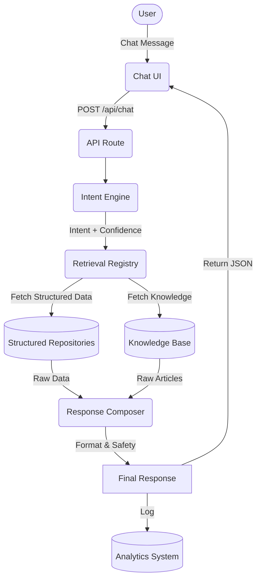

# Raya AI Architecture Documentation

**Version:** 3.0
**Date:** 2026-07-15
**Status:** Production Ready

---

## 1. Overview

Raya AI is the official AI assistant for Sri Raghavendra Swamy Matha. This document describes the hybrid retrieval architecture that ensures production-grade accuracy by making structured repositories the single source of truth.

### Key Principles

1. **No Hallucination** - Temple facts come from structured repositories, not LLM knowledge.
2. **Authoritative Retrieval** - Data is retrieved from appropriate repositories based on intent.
3. **Fallback Chain** - Multiple layers ensure reliability.
4. **Language Support** - Full support for English, Kannada, and mixed language.
5. **Supabase Ready** - Architecture designed for future Supabase migration.

---

## 2. Request Lifecycle

The application flow follows a strict `Intent -> Retrieve -> Compose` pipeline:

---

## 3. Intent Detection

The Intent Engine evaluates the user message using pattern matching, semantic similarity, and keyword extraction.
The system detects if the query is in English, Kannada, or Mixed language.

Results contain:
- `intent`: The classified intent (e.g., `TEMPLE_TIMINGS`).
- `confidence`: Score from 0-100.
- `language`: Detected language.

---

## 4. Retrieval Layer

The `lib/ai/retrieval/registry.ts` file acts as the router. It receives the `intent` and routes the query to the correct authoritative source.
Examples:
- `TEMPLE_TIMINGS` -> `getTempleSettings()`
- `NEXT_AARADHANE` -> `getNextAaradhane()`

---

## 5. Knowledge Base

The Knowledge Base (`lib/ai/knowledge/`) stores static, approved articles. It is only queried if the intent requires it (e.g., `TEMPLE_HISTORY`) or if structured data returns empty.
Articles are strictly typed to include `id, slug, title, category, keywords, content, language, status, published, version`.

---

## 6. Actions

The Action registry defines UI-side operations (like navigating to a gallery). These are decoupled from textual response generation and passed as metadata in the response.

---

## 7. Response Composition

The `lib/ai/response/composer.ts` class is responsible for formatting retrieved data into user-friendly strings. It ensures that business data is not hardcoded. The composer checks the `confidenceThreshold`. If the confidence is too low, it returns a safe fallback message.

---

## 8. Safety & Optional LLM

**Strict Hallucination Prevention:** The architecture explicitly forbids the LLM from inventing temple facts. If an LLM is enabled via `allowLLMOnlyResponse`, it only acts as a linguistic formatter over the retrieved structured data.

---

## 9. Analytics

All chat interactions, intent detections, and unknown questions are logged to the Analytics system. Low-confidence queries are flagged for admin review.

---

## 10. Admin Settings

AI behavior is configured centrally in the Admin AI Dashboard. These settings include:
- **General**: Bot Name, Welcome Message, Languages.
- **Safety**: Retrieval required, unknown behavior.
- **Extended Behavior**: Confidence threshold, knowledge result limits.

---

## 11. Database Architecture

The system uses Firebase Firestore, but is structured in a repository pattern so it can be swapped to PostgreSQL via Prisma/Supabase without rewriting the AI pipeline.

---

## 12. Firebase -> Supabase Migration Status

Currently, the `ai_settings` and `knowledge` modules interact with Firestore via their respective repositories.
**Next Steps for Migration:** Swap out `firebase/firestore` calls in `lib/ai/ai-settings/repository.ts` and `lib/ai/knowledge/repository.ts` with Supabase client calls. The rest of the pipeline remains unchanged.

---

## 13. Configuration Reference

See `docs/RAYA_AI_SETTINGS.md` for the configuration schema.

---

## 14. Troubleshooting

- **No Results Returned?** Ensure the confidence threshold in AI Settings is not set too high.
- **Wrong Facts?** Update the underlying Structured Repository or Knowledge Base article. Do not edit the Response Composer directly.
